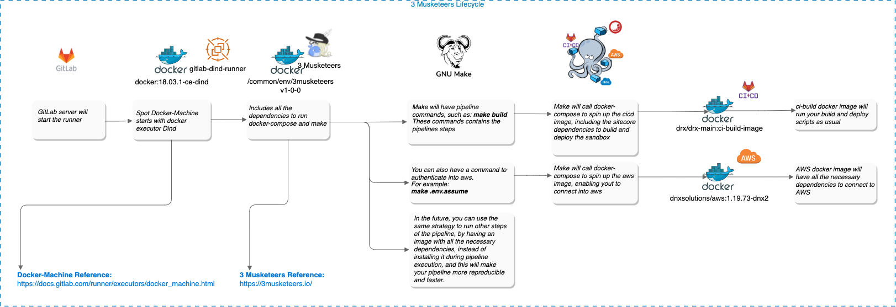
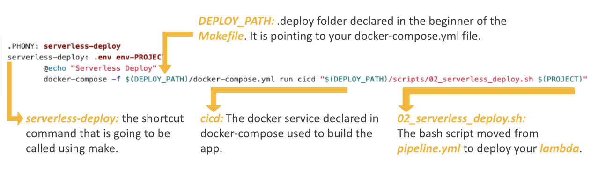
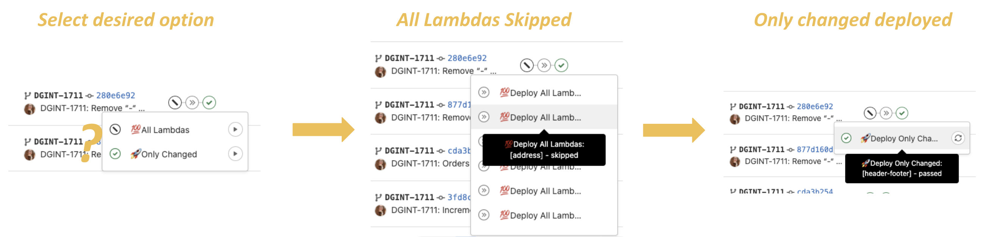
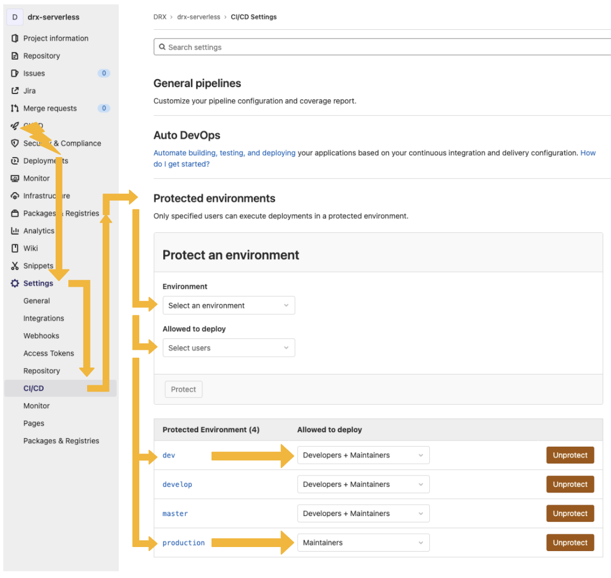

# AWS Infra Deploy

# Work instruction

## Necessary Tools

These tools are only required if you need to test/validate pipeline steps in your local machine, otherwise, this installation can be skipped.\
Please look at [Preparing local machine to use 3 Musketeers](https://cltd-confluence.cochlear.com/display/AT/01+-+Preparing+local+machine+to+use+3+Musketeers), to go to the installation guide.
| Tools | Name | Windows | Mac | Linux |
|------|-------------|------|---------|--------|
| WSL | Windows Subsystem for Linux |✔️ - Required to use WSL terminal and call make commands | ❌ - Not Required | ❌ - Not Required |
| Ubuntu | Ubuntu 20.04 LTS |✔️ - Required to run pipeline steps in the distribution | ❌ - Not Required | ❌ - Not Required |
| Make | GNU make |✔️- Required to create and use Makefile.<br/><i>Must be installed in the Ubuntu distribution</i> |✔️- Required to create and use Makefile | ✔️- Required to create and use Makefile |
| Docker | Docker |✔️- Required to build and run docker containers | ✔️- Required to build and run docker containers | ✔️- Required to build and run docker containers|
| Docker Compose | docker-compose |✔️- Required to spin up containers as a service | ✔️- Required to spin up containers as a service | ✔️- Required to spin up containers as a service|

# Overview of pipeline lifecycle

3 Musketeers will follow the life-cycle described below:\
1 - GitLab server starts the runner\
2 - The new instance will be a spot <b>docker-machine instance</b>, that will be <b>terminated </b> after execute your pipeline\
3 - The machine will include <b>3 musketeers</b>, with all dependencies to run <b>docker in docker</b>\
4 - The <b>make commands</b> declared in your <b>Makefile</b> will call the pipeline steps\
5 - The <b>make commands</b> will request <b>docker-compose</b> to spin up your services, such as <b>cicd</b> and <b>aws</b>\
6 - Each service will run the pipeline steps and the commands requested by <b>Makefile</b> inside the right containers



# Folder Structure

Everything related to the pipeline is now inside .deploy folder.

### Pipeline Scripts

Inside `.deploy/scripts` are all the bash scripts that were declared before inside `.buildkite/pipeline.yml` and `.buildkite/pipeline-prd.yml` .\
The scripts are now declared in files with the `.sh` extension, enabling a more readable view.

### Docker Compose

Docker compose is an orchestrator that is used to spin up your docker containers. It makes it easier to put your containers running using a single command and enables you to use your containers as a service.\
Inside `.deploy/docker-compose.yml` we will have the necessary configs to put the `cicd` container up and running during pipeline execution.

### .env

Inside `.env` file, are declared all the variables used during bash scripts execution.\
This `.env` file will be created during pipeline execution and will be injected inside the container, so it can be used by the scripts. The `.env.template` file is used as a recipe to create `.env` and will be filled during pipeline execution.\
We will `never` put secrets declared inside the `.env.template` because the template is `committed`.

# GitLab Pipeline (`gitlab-ci.yml`)

Contains all the pipeline steps to execute.\
This pipeline will be triggered from `dev`, `develop`, `master` and `production` branches to manage your `Lambdas Deployments`.\
Some lambdas are being used only to `dev` and `sit` environments, and you can notice this filter being managed by the regex:\
`$ENVIRONMENT =~ /^dev|^sit/`

```yml
'💯 Deploy All Lambdas: [cache-refresh]': # Not Deployed to PRD
  needs: ['💯  All Lambdas']
  stage: all-lambdas
  environment:
    name: $CI_COMMIT_BRANCH
  variables:
    PROVIDER: 'cache-refresh'
    PROJECT: 'redisCache'
    BASEPATH: 'cache'
  rules:
    - if: '$ENVIRONMENT =~ /^dev|^sit|^uat/'
  script:
    - make serverless-deploy PROJECT=${PROJECT}
    - make update-dns PROJECT=${PROJECT} BASEPATH=${BASEPATH}
    - make clear-stack PROJECT=${PROJECT}
  tags:
    - 'it_shared'

'💯 Deploy All Lambdas: [orders]':
  needs: ['💯  All Lambdas']
  stage: all-lambdas
  environment:
    name: $CI_COMMIT_BRANCH
  variables:
    PROVIDER: 'orders'
  rules:
    - if: '$ENVIRONMENT =~ /^dev|^sit|^uat/'
  script:
    - make serverless-deploy PROJECT="${PROVIDER//-}"
    - make update-dns PROJECT="${PROVIDER//-}" BASEPATH="${PROVIDER//-}"
    - make clear-stack PROJECT="${PROVIDER//-}"
  tags:
    - 'it_shared'
```

## Docker Compose (`docker-compose.yml`)

The docker-compose will be responsible to spin up the docker image created using `Dockerfile` and will run the bash scripts through `Makefile`.
The docker service was named `cicd`, and the `Makefile` will use this name to know which container to spin up.

```yml
version: '3.4'

services:
  aws:
    image: dnxsolutions/aws:1.19.73-dnx2
    entrypoint: '/bin/bash -c'
    env_file:
      - .env
      - .env.auth
      - .env.assume
  cicd:
    image: registry.cochlear.dev/drx/drx-main:ci-build-image
    working_dir: /work
    entrypoint: ['/bin/bash', '-c']
    env_file:
      - .env
      - .env.auth
      - .env.assume
    volumes:
      - ./..:/work
  shell:
    image: registry.cochlear.dev/drx/drx-main:ci-build-image
    working_dir: /work
    entrypoint: ['/bin/bash']
    env_file:
      - .env
    volumes:
      - ./..:/work
```

## Makefile

The `Makefile` will make the connection between `gitlab-ci.yml` and the new pipeline execution.\
It gives you the ability of using shortcut commands to run your scripts. Each rule will have a bunch of commands used by the pipeline or local execution.\
The `Makefile` gives you the ability to run `bash` scripts from another path while isolating yml scripts in the `gitlab-ci.yml` file.
You will also be able to run docker images using docker-compose through `Makefile`.


## Pipeline Approval Step

This project contains 11 lambdas, that can be deployed by selecting `All Lambdas` or `Only Changed`.\
The `All Lambdas` option will deploy all lambdas without making any distinction.\
The `Only Changed` option will deploy only the lambdas where a change is detected.\
Be aware that if you select `both` options at the `same time`, this will cause `issues` in the pipeline.\
You `should only` select `one option` at time.\
This is a step that requires a `manual approval`, and you can restrict it to only authorized people in your team. \
Below you have an example of the pipeline flow, when selecting the `Only Changed` option.



## Protecting Environments (Manual Approvals)

The users authorized to approve manual steps in the pipeline, should be defined in the CICD section.\
This process is good to define that only maintainers or specific users can authorize the deployment step of the pipeline \
to run into production or other environments.\
You can configure this as your preference, accordingly to your squad process, being able to attach an user or a group of users \
that are allowed to approve manual steps.\
The flow to include a new user/group, is illustrated on the image below.


