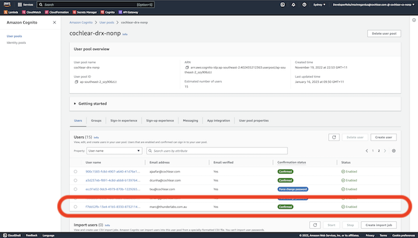
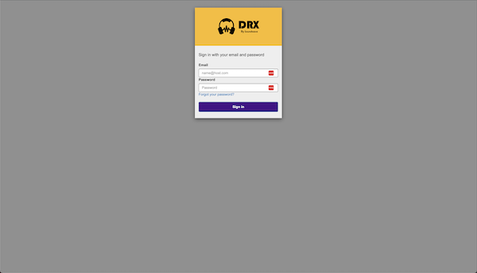
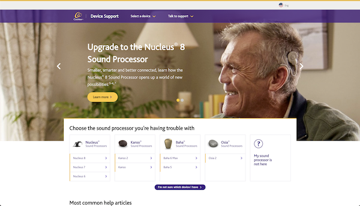

# API Gateway Setup

The API Gateway in AWS can be used in order to determine which lambda (and underlying code base) is being used to 
handle a give request. This documentation assumes you can access the Non Prod AWS environment.

## Example URL

Consider that we are working on the dev site and are trying to identify where a backend call is being made. Open 
a browser (with the dev tools - `Network` tab open) and go to the support page home:

- [https://dev-drx.cx.nonp.cochlear.cloud/us/en/home](https://dev-drx.cx.nonp.cochlear.cloud/us/en/home)

Note: this page is additionally protected using AWS Cognito. If you need access and haven't got a user, open the 
`cochlear-drx-nonp` pool and add yourself - as per the example below:

You will be asked for these details from the support page before you are able to proceed:

This will take you to the support site, as follows (**TODO - replace image when header isn't broken**):

Note: the support site - rather than the main Cochlear site - is used as the entry point, as it uses the same Universal 
Header, as the main site - but the main site is maintained by a different team. Therefore, for ease of initial setup,
the decision was made to use the support site as the entry point.

## Finding the code for a URL

Say you have the following backend API call that is causing problems and you'd like to be able to identify where the 
code resides (so you can spin the code up locally and fix the problem). From the network console in the browser, 
the URL is as follows:

- [https://dev.api.cochlear.com/drx/v1/contents/header-footer?lng=en&country=us](https://dev.api.cochlear.com/drx/v1/contents/header-footer?lng=en&country=us)
