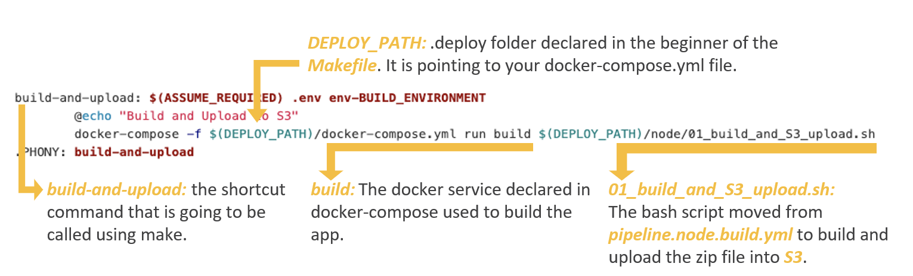
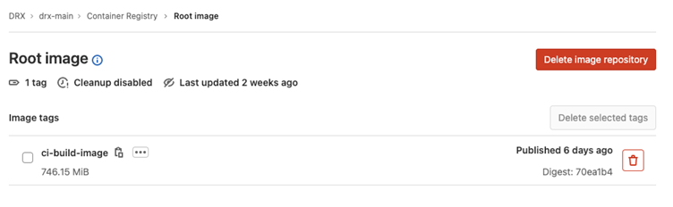

# DRX Main

# Work instruction

## Necessary Tools

These tools are only required if you need to test/validate pipeline steps in your local machine, otherwise, this installation can be skipped.\
Please look at [Preparing local machine to use 3 Musketeers](https://cltd-confluence.cochlear.com/display/AT/01+-+Preparing+local+machine+to+use+3+Musketeers), to go to the installation guide.
| Tools | Name | Windows | Mac | Linux |
|------|-------------|------|---------|--------|
| WSL | Windows Subsystem for Linux |✔️ - Required to use WSL terminal and call make commands | ❌ - Not Required | ❌ - Not Required |
| Ubuntu | Ubuntu 20.04 LTS |✔️ - Required to run pipeline steps in the distribution | ❌ - Not Required | ❌ - Not Required |
| Make | GNU make |✔️- Required to create and use Makefile.<br/><i>Must be installed in the Ubuntu distribution</i> |✔️- Required to create and use Makefile | ✔️- Required to create and use Makefile |
| Docker | Docker |✔️- Required to build and run docker containers | ✔️- Required to build and run docker containers | ✔️- Required to build and run docker containers|
| Docker Compose | docker-compose |✔️- Required to spin up containers as a service | ✔️- Required to spin up containers as a service | ✔️- Required to spin up containers as a service|

# Overview of pipeline lifecycle

3 Musketeers will follow the life-cycle described below:\
1 - GitLab server starts the runner\
2 - The new instance will be a spot <b>docker-machine instance</b>, that will be <b>terminated </b> after execute your pipeline\
3 - The machine will include <b>3 musketeers</b>, with all dependencies to run <b>docker in docker</b>\
4 - The <b>make commands</b> declared in your <b>Makefile</b> will call the pipeline steps\
5 - The <b>make commands</b> will request <b>docker-compose</b> to spin up your services, such as <b>cicd</b> and <b>aws</b>\
6 - Each service will run the pipeline steps and the commands requested by <b>Makefile</b> inside the right containers


# Folder Structure

Everything related to the pipeline is now inside .deploy folder.

## Pipeline Scripts

Inside `.deploy/node` are all the bash scripts that were declared before inside `pipeline.node.build.yml`.\
The scripts are now declared in files with the `.sh` extension, enabling a more readable view.\

## Dockerfile

We will use a docker image to run all the scripts inside node folder. The image contains all the necessary dependencies, such as `aws`, `zip` and `make`. The `Dockerfile` used to create this image is inside `.deploy/gitlab-ci-docker`.

## Docker Compose

Docker compose is an orchestrator that is used to spin up your docker containers. It makes it easier to put your containers running using a single command and enables you to use your containers as a service.\
Inside `.deploy/docker-compose.yml` we will have the necessary configs to put the `cicd` container up and running during pipeline execution.

## .env

Inside `.env` file, are declared all the variables used during bash scripts execution.\
This `.env` file will be created during pipeline execution and will be injected inside the container, so it can be used by the scripts. The `.env.template` file is used as a recipe to create `.env` and will be filled during pipeline execution.\
We will `never` put secrets declared inside the `.env.template` because the template is `committed`.

# GitLab Pipeline (`gitlab-ci.yml`)

Contains all the pipeline steps to execute.\
The first step (`Build and Upload to S3`) will build your application and generate an artifact zip file. \
This file will be uploaded into `S3`.\
The second one (`Deploy`), will trigger another pipeline in the same repo, but in another branch. \
This pipeline will manage your `AWS resources` in the `aws-infra-deploy` branch.\

```yml
'🏛  Build and Upload to S3':
  stage: build-and-upload
  only:
    variables:
      - $BUILD_ENVIRONMENT =~ /^dev|^sit|^uat|^prd|^preview-dev|^preview-prd/
  environment:
    name: $CI_COMMIT_REF_SLUG
  script:
    - make build-and-upload
  tags:
    - 'it_shared'

'🚀  Deploy':
  stage: trigger-deployment
  only:
    variables:
      - $BUILD_ENVIRONMENT =~ /^dev|^sit|^uat|^prd|^preview-dev|^preview-prd/
  script:
    - make deploy
  tags:
    - 'it_shared'
```

## Docker Compose (`docker-compose.yml`)

The docker-compose will be responsible to spin up the docker image created using `Dockerfile` and will run the bash scripts through `Makefile`.
The docker service was named `build`, and the `Makefile` will use this name to know which container to spin up.

```yml
version: '3.4'

services:
  aws:
    image: dnxsolutions/aws:1.19.73-dnx2
    entrypoint: '/bin/bash -c'
    env_file:
      - .env
      - .env.auth
      - .env.assume
  build:
    image: ${CI_REGISTRY}/drx/drx-main:ci-build-image
    working_dir: /work
    entrypoint: ['/bin/bash', '-c']
    env_file:
      - .env
    volumes:
      - ./..:/work
  shell:
    image: ${CI_REGISTRY}/drx/drx-main:ci-build-image
    working_dir: /work
    entrypoint: ['/bin/bash']
    env_file:
      - .env
    volumes:
      - ./..:/work
```

## Makefile

The `Makefile` will make the connection between `gitlab-ci.yml` and the new pipeline execution.\
It gives you the ability of using shortcut commands to run your scripts. Each rule will have a bunch of commands used by the pipeline or local execution.\
The `Makefile` gives you the ability to run `bash` scripts from another path while isolating yml scripts in the `gitlab-ci.yml` file.
You will also be able to run docker images using docker-compose through `Makefile`.


## Docker Image on Registry

The docker image we are using during deployment, should be updated and pushed to registry every time a change is made in the image.
To solve this, we created a new step in the pipeline, that is going to build and update the image, every time a change is detected:
Pipeline step in `gitlab-ci.yml`:

```yml
'🐳  Docker CI Update':
  stage: gitlab-ci-docker
  only:
    changes:
      - .deploy/gitlab-ci-docker/Dockerfile
  script:
    - make gitlab-ci-docker
  tags:
    - 'it_shared'
```

Commands performed in `Makefile` to `build` and `push` the image in `registry`.

```bash
export CI_IMAGE=${CI_REGISTRY}/drx/drx-main:ci-build-image
.PHONY: gitlab-ci-docker
gitlab-ci-docker:
  @echo "Update gitlab-ci-docker"
  docker build --force-rm --no-cache --pull -f .deploy/gitlab-ci-docker/Dockerfile -t $(CI_IMAGE) .
  docker push $(CI_IMAGE)
```

Docker Build and Push

```bash
make gitlab-ci-docker
```

The image in gitlab container registry:



## Private NPM Package on Registry

The `drx-main` project has a requirement to install an NPM package from the private cochlear registry. \
A `.npmrc` configuration file was included in all folders that contains a `package.json` file and need to \
perform an `npm install` command during pipeline execution. \
This will give the runner the ability to authenticate in the private registry and pull your package.

The `.npmrc` config file content:

```bash
@digital:registry=https://gitlab.cochlear.dev/api/v4/packages/npm/
//gitlab.cochlear.dev/api/v4/packages/npm/:_authToken=${GITLAB_TOKEN_READONLY}
```

Local execution example:

```bash
export GITLAB_TOKEN_READONLY=<personal_token>
npm i @digital/cochlear-design-system
```

## Assuming Role on Runner

```
export AWS_ACCOUNT_ID=<redacted>
export AWS_ROLE=<redacted>

make .env.assume
```

## Build and Upload to S3

### Dev - Build and Upload to S3

```
export BUILD_ENVIRONMENT=dev
export APP_STACK_NAME=cochlear-drx-main-dev-webservice

make build-and-upload
```

### Uat - Build and Upload to S3

```
export BUILD_ENVIRONMENT=uat
export APP_STACK_NAME=cochlear-drx-main-uat-webservice

make build-and-upload
```

### Sit - Build and Upload to S3

```
export BUILD_ENVIRONMENT=sit
export APP_STACK_NAME=cochlear-drx-main-sit-webservice

make build-and-upload
```
